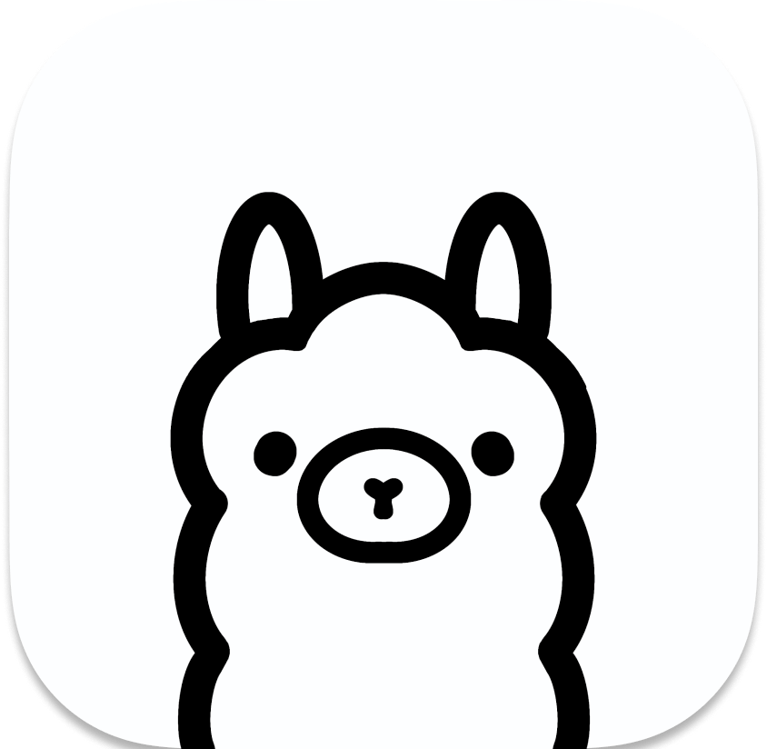
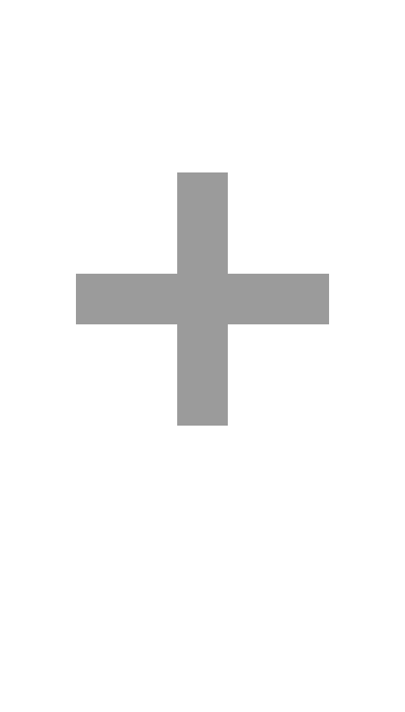

    
<a href="#"></a>

    <h1>Discord Ollama Integration</h1>
    <h3>Ollama as your Discord AI Assistant</h3>
    

    
    
    
    
    

## About/Goals
Ollama is an AI model management tool that allows users to install and use custom large language models locally.  
The project aims to:
* [x] Create a Discord bot that will utilize Ollama and chat to chat with users! 
  * [x] User and Server Preferences
  * [x] Message Persistance
  * [x] Containerization with Docker
  * [x] Slash Commands Compatible
    * [ ] Summary Command
    * [ ] Model Info Command
    * [ ] List Models Command
    * [x] Pull Model Command
    * [x] Switch Model Command
    * [x] Delete Model Command
    * [x] Create Thread Command
    * [x] Create Private Thread Command
    * [x] Message Stream Command
    * [x] Change Message History Size Command
    * [x] Clear Channel History Command (User Only)
    * [x] Administrator Role Compatible
  * [x] Generated Token Length Handling for >2000
    * [x] Token Length Handling of any message size
  * [x] Multi-User Chat Generation - This was built in from Ollama `v0.2.1+`
  * [ ] Ollama Tool Support Implementation
  * [ ] Enhanced Channel Context Awareness
  * [ ] Improved User Replied Triggers

Further, Ollama provides the functionality to utilize custom models or provide context for the top-layer of any model available through the Ollama model library.
* [Customize a model](https://github.com/ollama/ollama#customize-a-model)
* [Modelfile Docs](https://github.com/ollama/ollama/blob/main/docs/modelfile.md)

## Documentation
These are guides to the features and capabilities of this app.
* [User Slash Commands](./docs/commands-guide.md)
* [Client Events](./docs/events-guide.md)

## Environment Setup
* Clone this repo using `git clone https://github.com/kevinthedang/discord-ollama.git` or just use [GitHub Desktop](https://desktop.github.com/) to clone the repo.
* You will need a `.env` file in the root of the project directory with the bot's token. There is a `.env.sample` is provided for you as a reference for what environment variables.
    * For example, `CLIENT_TOKEN = [Bot Token]`
* Please refer to the docs for bot setup.
    * [Creating a Discord App](./docs/setup-discord-app.md)
    * [Local Machine Setup](./docs/setup-local.md)
    * [Docker Setup for Servers and Local Machines](./docs/setup-docker.md)
        * Nvidia is recommended for now, but support for other GPUs should be development.
        * Local use is not recommended.

## Resources
* [NodeJS](https://nodejs.org/en)
    * This project runs on `lts\jod` and above. 
    * This project requires the use of npm version `10.9.0` or above.
* [Ollama](https://ollama.com/)
    * [Ollama Docker Image](https://hub.docker.com/r/ollama/ollama)
* [Discord.js Docs](https://discord.js.org/docs/packages/discord.js/main)
* [Setting up Docker (Ubuntu 20.04)](https://www.digitalocean.com/community/tutorials/how-to-install-and-use-docker-on-ubuntu-20-04)
    * [Setting up Nvidia Container Toolkit](https://docs.nvidia.com/datacenter/cloud-native/container-toolkit/latest/install-guide.html)

## Acknowledgement
* [Kevin Dang](https://github.com/kevinthedang)
* [Jonathan Smoley](https://github.com/JT2M0L3Y)

[discord-ollama](https://github.com/kevinthedang/discord-ollama) © 2023 by [Kevin Dang](https://github.com/kevinthedang) is licensed under [CC BY 4.0](https://creativecommons.org/licenses/by/4.0/)
