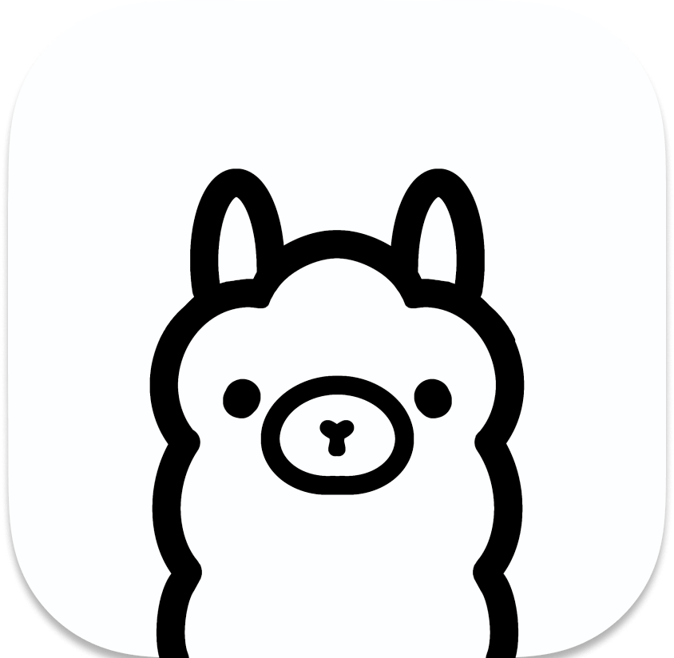
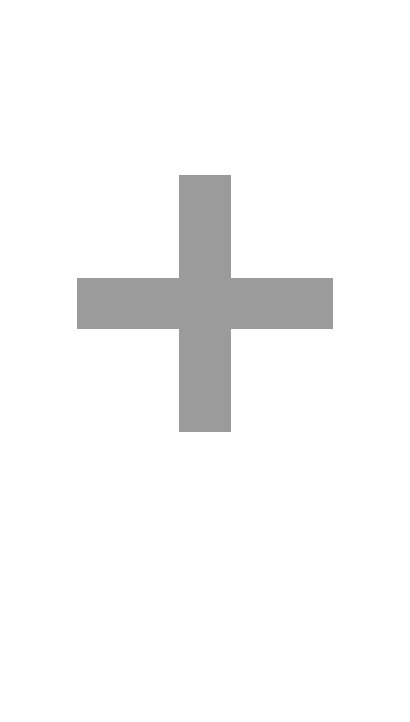
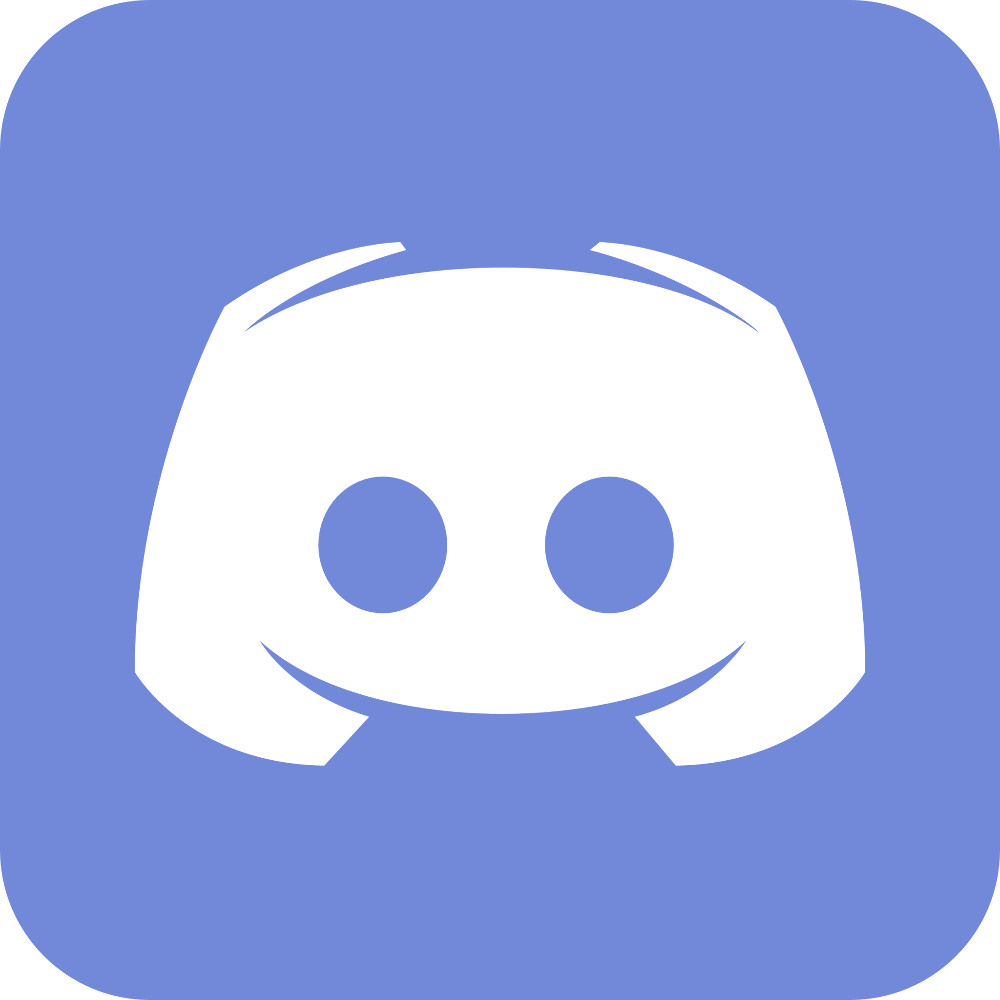

    
<a href="#"></a>

    <h1>Discord Ollama Integration</h1>
    <h3>Ollama as your Discord AI Assistant</h3>
    

    
    
    

## About
Discord Ollama is a Discord bot that lets users interact with locally hosted
Ollama language models directly from Discord.

The bot supports model management, streamed responses, conversation history,
private threads, and configurable server controls. Because Ollama runs locally,
you retain control over the models and data used by the bot.

See the [setup guides](./docs/setup-local.md) to get started.

## Documentation
These are guides to the features and capabilities of this app.
* [User Slash Commands](./docs/commands-guide.md)
* [Client Events](./docs/events-guide.md)

## Environment Setup
* Clone this repo using `git clone https://github.com/kevinthedang/discord-ollama.git` or just use [GitHub Desktop](https://desktop.github.com/) to clone the repo.
* You will need a `.env` file in the root of the project directory with the bot's token. There is a `.env.sample` is provided for you as a reference for what environment variables.
    * For example, `CLIENT_TOKEN = [Bot Token]`
    * The LLM server is configured with `LLM_ENDPOINT` / `LLM_PORT` (`OLLAMA_IP` / `OLLAMA_PORT` still work as deprecated aliases).
* Please refer to the docs for bot setup.
    * [Creating a Discord App](./docs/setup-discord-app.md)
    * [Local Machine Setup](./docs/setup-local.md)
    * [Docker Setup for Servers and Local Machines](./docs/setup-docker.md)
        * Nvidia is recommended for now, but support for other GPUs should be development.
        * Local use is not recommended.

## Resources
* [NodeJS](https://nodejs.org/en)
    * This project runs on `lts\jod` and above. 
    * This project requires the use of npm version `10.9.0` or above.
* [Ollama](https://ollama.com/)
    * [Ollama Docker Image](https://hub.docker.com/r/ollama/ollama)
    * [llmman](https://github.com/llmmanorg/llmman) also serves the Ollama API (on port `17434`) and can be used in its place, see [Local Machine Setup](./docs/setup-local.md#using-with-llmman-alternative-to-ollama).
* [Discord.js Docs](https://discord.js.org/docs/packages/discord.js/main)
* [Setting up Docker (Ubuntu 20.04)](https://www.digitalocean.com/community/tutorials/how-to-install-and-use-docker-on-ubuntu-20-04)
    * [Setting up Nvidia Container Toolkit](https://docs.nvidia.com/datacenter/cloud-native/container-toolkit/latest/install-guide.html)

## Acknowledgement
* [Kevin Dang](https://github.com/kevinthedang)
* [Jonathan Smoley](https://github.com/JT2M0L3Y)

[discord-ollama](https://github.com/kevinthedang/discord-ollama) © 2023 by [Kevin Dang](https://github.com/kevinthedang) is licensed under [CC BY 4.0](https://creativecommons.org/licenses/by/4.0/)
