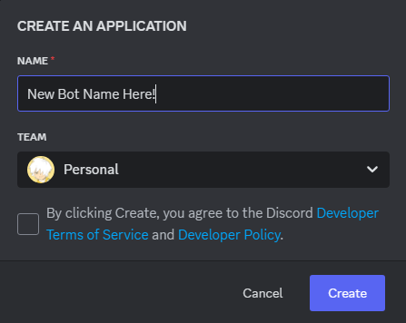
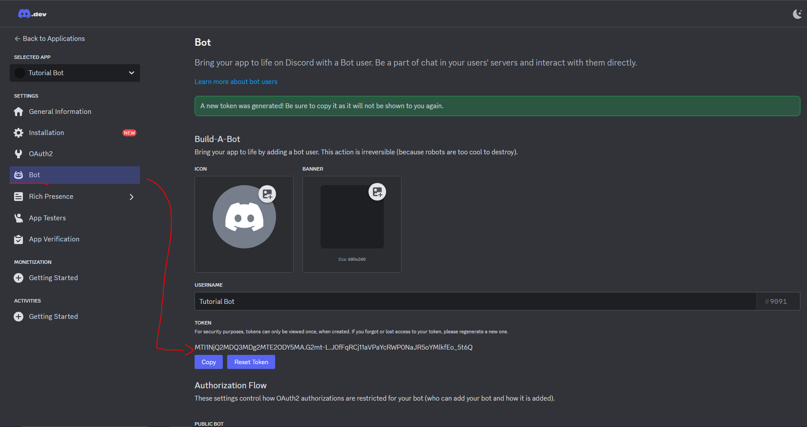
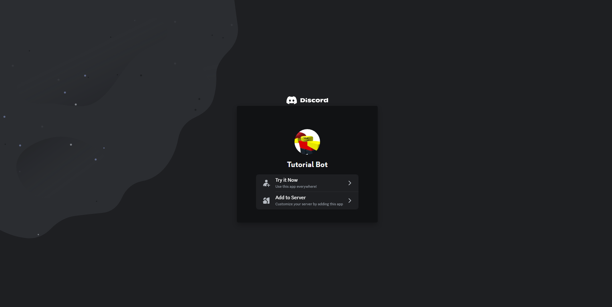

## Discord App/Bot Setup
* Refer to the [Discord Developers](https://discord.com/build/app-developers) tab on their site.
* Click on **Getting Started** and it may prompt you to log in. Do that.
* You should see this upon logging in.

* Click on **Create App**, you should not be prompted to create an App with a name. If you are apart of a team, you may choose to create it for your team or for yourself.

* Great! Not you should have your App created. It should bring you to a page like this.

* From here, you will need you App's token, navigate to the **Bot** tab and click **Reset Token** to generate a new token to interact with you bot.
* The following app will not exist, usage of this token will be pointless as this is a guide.

* That should be all of the environment variables needed from Discord, now we need this app on your server.
* Navigate to **Installation** and Copy the provided **Install Link** to allow your App to your server.
* You should set the **Guild Install** permissions as you like, for this purpose we will allow admin priviledges for now. Ensure the **bot** scope is added to do this.

* Notice that your App's **Client Id** is apart of the **Install Link**.
* Paste this link in a web browser and you should see something like this.

* Click **Add to Server** and you should see this.

* Choose a server to add the App to, then click **Continue** then **Authorize**. You should see this after that.

* Congratulations! You should now see you App on your server!

